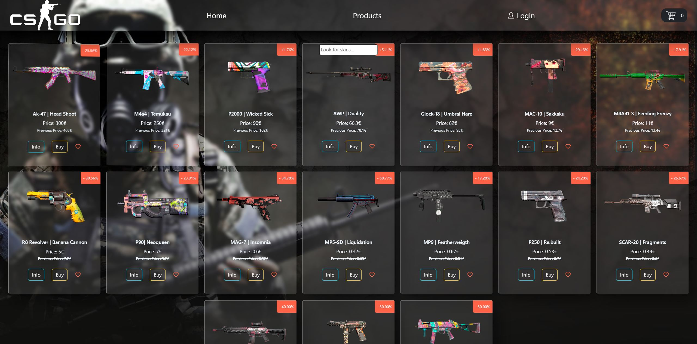
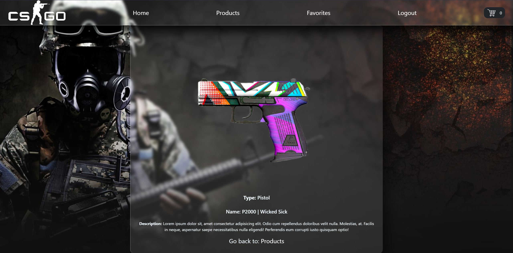
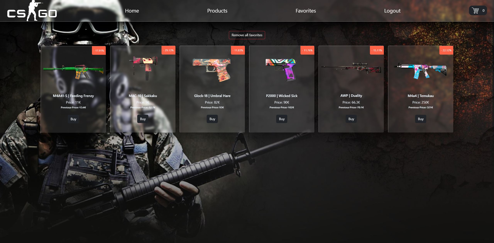
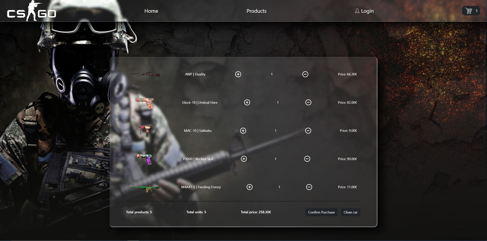

#  E-commerce react

This project has implemented the use of predefined react hooks, such as useState, useEffect, useContext, useReducer etc... .
As well as the concept of separation of concerns, and different types of practices to maintain the best possible order.

## Media

### Product page

### Detail page

### Favorites page

### Cart page

### Prerequisites

In the project directory, you can run:

## `npm start`

Runs the app in the development mode.\
Open [http://localhost:3000](http://localhost:3000) to view it in your browser.

## `npm run api-weapons`

Runs the fake API with json-server to launch the db .\
Open [http://localhost:3002](http://localhost:3002) to view it in your browser.

### Project Description

In this project, an e-commerce is simulated with the different sections that it can have, such as the product page, the shopping cart, the possibility of editing the number of products in the cart, the favorite products section and a more detailed description of the article. .

### Used Technologies
React:
https://es.reactjs.org/

Nodejs:
https://nodejs.org/

HTML:
https://developer.mozilla.org/es/docs/Web/HTML

Git:
https://git-scm.com/

### Used Libraries

CRA(create-react-app)
https://create-react-app.dev/

React router:
https://reactrouter.com/

React loader:
https://www.npmjs.com/package/react-loader-spinner

React icons:
https://react-icons.github.io/react-icons/

React toastify:
https://www.npmjs.com/package/react-toastify

Bootstrap:
https://getbootstrap.com/

Vanilla tilt:
https://micku7zu.github.io/vanilla-tilt.js/

### Used IDE
https://code.visualstudio.com/

## Autors

<li>Dayan Álvarez Martínez</li>
